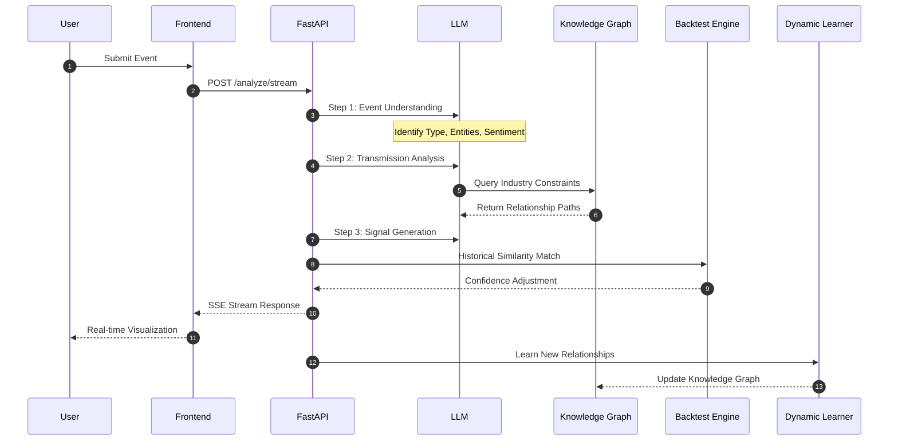
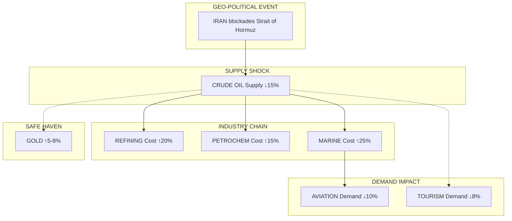
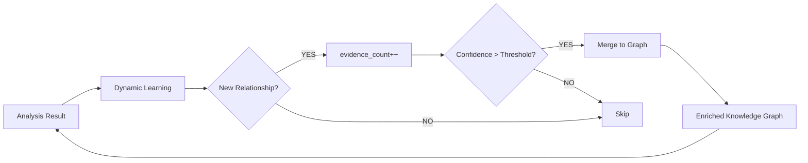
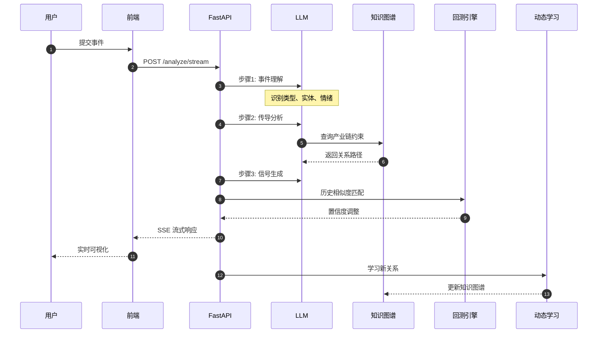
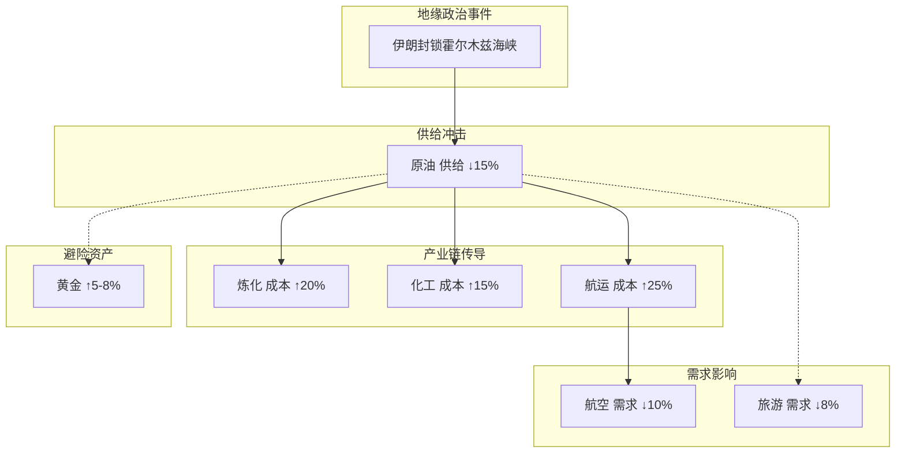
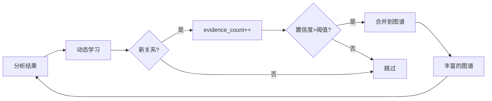

# Event Trading Intelligence System | 事件驱动交易智能系统

<div align="center">

### AI-Powered Event-Driven Trading Analysis Platform
### 基于大语言模型的事件驱动交易分析系统

[](https://www.python.org/)
[](https://fastapi.tiangolo.com/)
[](https://nextjs.org/)
[](https://www.typescriptlang.org/)
[](https://pytorch.org/)
[]()
[](https://www.docker.com/)

**[English](#english-version) | [中文版](#中文版)**

</div>

---

<a name="english-version"></a>

# English Version | 英文版

---

## Table of Contents

1. [System Architecture](#1-system-architecture)
2. [Analysis Pipeline](#2-analysis-pipeline)
3. [Transmission Reasoning Example](#3-transmission-reasoning-example)
4. [Project Philosophy](#4-project-philosophy)
5. [Core Capabilities](#5-core-capabilities)
6. [Technical Highlights](#6-technical-highlights)
7. [System Demonstration](#7-system-demonstration)
8. [Tech Stack](#8-tech-stack)
9. [Project Structure](#9-project-structure)
10. [API Reference](#10-api-reference)
11. [Deployment Guide](#11-deployment-guide)
12. [License](#12-license)

---

## 1. System Architecture

```
┌─────────────────────────────────────────────────────────────────────────────────────────────┐
│                                        USER INPUT                                            │
│                              "US-IRAN Military Conflict"                                     │
└─────────────────────────────────────────────────────────────────────────────────────────────┘
                                              │
                    ┌─────────────────────────┼─────────────────────────┐
                    │                         │                         │
                    ▼                         ▼                         ▼
┌───────────────────────────────────┐ ┌───────────────────────────────┐ ┌───────────────────┐
│  ┌─────────┐ ┌─────────┐         │ │ ┌─────────┐ ┌─────────┐       │ │ ┌─────────┐       │
│  │ Event   │ │ Trans.  │         │ │ │ Trans.  │ │ Back-   │       │ │ │ Signal  │       │
│  │ Summary │ │ Map     │         │ │ │ Details │ │ test    │       │ │ │ Report  │       │
│  └────┬────┘ └────┬────┘         │ │ └────┬────┘ └────┬────┘       │ │ └────┬────┘       │
└───────┼───────────┼───────────────┼─┼──────┼──────────┼────────────┼─┼──────┼─────────────┘
        │           │               │ │      │          │            │ │      │
        │    SSE Streaming ◄────────┘ │      │          │            │ │      │
        │           │                 │      │          │            │ │      │
        ▼           ▼                 ▼      ▼          ▼            ▼ ▼      ▼
┌────────────────────────────────────────────────────────────────────────────────────────────┐
│                                       FastAPI Gateway                                         │
│                           /api/v1/analyze  |  /api/v1/analyze/stream                         │
└─────────────────────────────────────────────────────────────────────────────────────────────┘
                                              │
                    ┌─────────────────────────┼─────────────────────────┐
                    │                         │                         │
                    ▼                         ▼                         ▼
        ┌───────────────────┐     ┌───────────────────────┐     ┌───────────────────┐
        │      STEP 1       │     │       STEP 2          │     │      STEP 3       │
        │  ┌─────────────┐  │     │  ┌─────────────────┐  │     │  ┌─────────────┐  │
        │  │ Event       │  │     │  │ Transmission    │  │     │  │ Signal      │  │
        │  │ Understanding│ │───► │  │ Analysis       │  │───► │  │ Generation  │  │
        │  │   (LLM)    │  │     │  │ (LLM + Graph)  │  │     │  │   (LLM)    │  │
        │  └─────────────┘  │     │  └────────┬────────┘  │     │  └─────────────┘  │
        └───────────────────┘     └───────────┼───────────┘     └───────────────────┘
                                              │
                    ┌─────────────────────────┼─────────────────────────┐
                    │                         │                         │
                    ▼                         ▼                         ▼
           ┌────────────────┐      ┌────────────────────┐       ┌────────────────┐
           │    Knowledge   │      │      Dynamic        │       │    Backtest   │
           │      Graph     │      │      Learning       │       │     Engine    │
           │  Industry Rel.  │      │    Feedback Loop   │       │  Confidence   │
           └────────┬───────┘      └─────────┬──────────┘       └────────┬───────┘
                    │                         │                         │
                    └─────────────────────────┼─────────────────────────┘
                                              │
                                              ▼
                                 ┌────────────────────────┐
                                 │      RAG Service       │
                                 │  Real-time Market Data  │
                                 └───────────┬────────────┘
                                             │
                                             ▼
                                 ┌────────────────────────┐
                                 │   AkShare / Tushare    │
                                 │   Financial Data API   │
                                 └────────────────────────┘
```

---

## 2. Analysis Pipeline



---

## 3. Transmission Reasoning Example

### 3.1 Flow Diagram



### 3.2 Transmission Chains

| Path | Type | Rate | Delay |
|:-----|:-----|:-----|:------|
| IRAN → CRUDE OIL | Supply Shock | 100% | 1-3d |
| CRUDE OIL → REFINING | Cost Transmission | 70% | 3d |
| CRUDE OIL → PETROCHEM | Cost Transmission | 60% | 7d |
| CRUDE OIL → MARINE | Cost Transmission | 80% | 1d |
| MARINE → AVIATION | Cost Transmission | 70% | 5d |
| CRUDE OIL → TOURISM | Risk Aversion | - | - |
| CRUDE OIL → GOLD | Safe Haven | - | - |

---

## 4. Project Philosophy

In the globalized market, major geo-political events, policy changes, and unexpected disasters often transmit rapidly through industry chains within hours to days, triggering chain reactions in related stock prices. Traditional quantitative models relying on historical data struggle to capture these "black swan" events' atypical impacts.

This system leverages LLM's logical reasoning capability to **automatically construct industry chain transmission paths** from raw events, combined with knowledge graph constraints, backtest verification, and real-time market data to generate actionable trading signals.

### Key Innovations

| Innovation | Description |
|:-----------|:------------|
| **LLM-Driven Reasoning** | Go beyond historical patterns to reason about novel events |
| **Graph-Constrained Transmission** | Deterministic relationships + flexible generalization |
| **Confidence Calibration** | Backtest-driven signal reliability |
| **Self-Learning Loop** | Continuous knowledge graph enrichment |

---

## 5. Core Capabilities

| Capability | Description |
|:-----------|:------------|
| **Event Understanding** | LLM auto-identifies event type (geo-political/policy/disaster/economic), core entities, market sentiment |
| **Industry Chain Transmission** | Multi-level transmission reasoning (cost transmission / demand transmission / substitution effect) |
| **Trading Signals** | Long/short signals with confidence levels, supporting A-shares, US stocks, ETFs |
| **Backtest Verification** | Dynamic confidence adjustment based on historical similar events |
| **Dynamic Learning** | Auto-discover new industry chain relationships, build feedback loop |
| **Real-time Streaming** | SSE streaming display of LLM reasoning process |

---

## 6. Technical Highlights

### 6.1 Layered LLM Pipeline

```
STEP 1 (Event Understanding) ──► STEP 2 (Transmission Analysis) ──► STEP 3 (Signal Generation)
```

Each step's output feeds into the next, with context progressively enriching. All LLM calls require structured JSON output with Pydantic validation for type safety.

### 6.2 Knowledge Graph as Deterministic Skeleton

```python
# Industry Knowledge Graph (networkx + JSON)
# Nodes: Crude Oil, Natural Gas, Petrochem, Aviation...
# Edges: Crude Oil → Petrochem (cost transmission, 70%, 7 days)
# Edges: Crude Oil → Marine (cost transmission, 80%, 1 day)

# During transmission analysis, inject formatted graph constraints
# "Prioritize graph constraints, supplement cross-industry links"
```

Knowledge graph provides deterministic industry chain relationships; LLM reasons beyond coverage for cross-industry generalization while maintaining accuracy.

### 6.3 Dynamic Learning Feedback



From analysis results, automatically learn new industry chain relationships (evidence_count increments to boost confidence), discovered event patterns are used for type matching enhancement.

### 6.4 Backtest-Driven Confidence Calibration

```
Current Event ──► Historical Similarity Match ──► Confidence Adjustment
                  (Weighted: Title 25%, Type 20%, Entity 30%, Sentiment 25%)

High Similarity (>0.8) ──► +10% Confidence
Low Similarity (<0.4)  ──► -10% Confidence
```

Not executing backtest trades, but dynamically adjusting signal confidence based on historical event patterns to improve signal reliability.

### 6.5 Event Type Driven RAG Context

```python
EVENT_TYPE_CONTEXT_MAP = {
    "geo-political": {
        "news_priority": ["geo", "conflict", "sanction", "diplomacy"],
        "market_data": ["energy", "military", "gold", "forex"],
        "include_hot_sectors": True
    },
    "policy": {
        "news_priority": ["central bank", "fiscal", "regulation"],
        "market_data": ["bank", "securities", "real estate", "insurance"],
        ...
    },
    ...
}
```

RAG service selectively injects relevant context (news priority + market data types) based on event type, not retrieving all data to reduce noise.

### 6.6 Pure SVG Hand-Drawn Transmission Graph

Frontend implements pure SVG hand-drawn transmission network (no third-party libraries), featuring:
- **Layered Layout Algorithm** (stratified by transmission depth, same layer vertically centered)
- **Bezier Curve Edges** (cubic Bezier curves connecting nodes)
- **Edge Width Encoding** (higher transmission rate = thicker edge)
- **Interactive Hover** (highlight related edges, display Tooltip)

---

## 7. System Demonstration

### 7.1 Input

```
US-IRAN military conflict, Iran blockades Strait of Hormuz
```

### 7.2 Output

#### Step 1: Event Understanding
- **Event Type:** Geo-political
- **Core Entities:** USA, Iran, Strait of Hormuz
- **Market Sentiment:** -0.85 (extremely bearish)
- **Direct Impact:** Crude Oil (supply reduction, +8), Marine (cost increase, -5)

#### Step 2: Transmission Analysis

| Source | Target | Type | Rate | Delay |
|:-------|:-------|:-----|:-----|:------|
| CRUDE OIL | REFINING | Cost Transmission | 70% | 3d |
| CRUDE OIL | PETROCHEM | Cost Transmission | 60% | 7d |
| CRUDE OIL | MARINE | Cost Transmission | 80% | 1d |
| MARINE | AVIATION | Cost Transmission | 70% | 5d |

#### Step 3: Trading Signals

| Industry | Signal | Confidence | Related Assets |
|:---------|:-------|:-----------|:---------------|
| Oil Exploration | LONG | 85% | CNOOC, XOM, CVX |
| Marine Shipping | SHORT | 75% | Cosco, CMA CGM |
| Aviation | SHORT | 70% | Air China, American Airlines |

---

## 8. Tech Stack

| Layer | Technology |
|:------|:-----------|
| **Backend** | FastAPI, Python 3.11+, Pydantic, networkx, uvicorn |
| **LLM** | SiliconFlow (Recommended), OpenAI, Claude, Ollama |
| **Frontend** | Next.js 14, React 18, TypeScript, Tailwind CSS |
| **Graph** | networkx, pyvis (Interactive), Pure SVG (Hand-drawn) |
| **Data** | AkShare, Tushare (Free Data Sources) |
| **Infra** | Docker, Docker Compose v2, Nginx |

---

## 9. Project Structure

```
event-trading-system/
├── deploy.sh              # VPS one-click deployment script
├── docker-compose.yml     # Container orchestration (with Nginx)
├── nginx.conf             # Nginx configuration (HTTP + HTTPS template)
├── .env.example           # Environment variables template
│
├── backend/
│   ├── app/
│   │   ├── main.py           # FastAPI entry point
│   │   ├── config.py         # Configuration management
│   │   ├── schemas/
│   │   │   └── models.py     # Pydantic data models
│   │   └── services/
│   │       ├── llm_client.py       # Multi-LLM wrapper + fallback
│   │       ├── prompts.py          # Prompt templates
│   │       ├── analysis.py         # Event analysis (core orchestration)
│   │       ├── rag_service.py      # RAG real-time context
│   │       ├── network_graph.py    # Transmission graph generation
│   │       ├── semantic_matcher.py # Semantic matcher
│   │       ├── causal_reasoning/   # Causal reasoning module
│   │       │   ├── industry_graph.py
│   │       │   ├── dynamic_graph_learner.py
│   │       │   └── llm_reasoner.py
│   │       ├── signal_output/
│   │       │   └── llm_explainer.py
│   │       ├── impact_quant/       # Backtest system
│   │       │   ├── event_backtest.py
│   │       │   └── historical_signals.py
│   │       ├── event_extraction/
│   │       │   └── llm_extractor.py
│   │       └── data_providers/      # Data providers
│   │           ├── base.py
│   │           ├── akshare_provider.py
│   │           └── tushare_provider.py
│   └── requirements.txt
│
└── frontend/
    ├── src/
    │   ├── app/page.tsx
    │   ├── components/
    │   │   ├── TransmissionGraph.tsx
    │   │   ├── TransmissionChain.tsx
    │   │   ├── SentimentMeter.tsx
    │   │   ├── DegradationBanner.tsx
    │   │   └── Sidebar.tsx
    │   ├── hooks/
    │   │   └── useAnalysis.ts
    │   └── types/
    │       └── index.ts
    └── Dockerfile
```

---

## 10. API Reference

### 10.1 Analyze Event (Non-Streaming)

```http
POST /api/v1/analyze
Content-Type: application/json

{
  "title": "US-IRAN Military Conflict",
  "content": "Iran announces blockade of Strait of Hormuz..."
}
```

### 10.2 Analyze Event (Streaming)

```http
POST /api/v1/analyze/stream
```

Response: Server-Sent Events (SSE) stream

### 10.3 Knowledge Graph

```http
# Statistics
GET /api/v1/knowledge-graph/stats

# Relationships
GET /api/v1/knowledge-graph/relationships?min_confidence=0.5
```

### 10.4 Historical Events

```http
GET /api/v1/history/events
```

### 10.5 Health Check

```http
GET /health
```

---

## 11. Deployment Guide

### 11.1 Local Deployment

#### Prerequisites
- Docker Desktop 20.10+
- Git

#### Steps

```bash
# 1. Clone repository
git clone https://github.com/mkih76/event-driven-trading-system.git
cd event-driven-trading-system

# 2. Configure environment
cp .env.example .env
# Edit .env to add SILICONFLOW_API_KEY

# 3. Start services
docker compose up -d

# 4. Access
# Frontend: http://localhost
# API: http://localhost:8080
# Health: http://localhost:8080/health
```

#### Manual Setup (Alternative)

**Backend:**
```bash
cd backend
python -m venv venv
source venv/bin/activate  # Windows: venv\Scripts\activate
pip install -r requirements.txt
cp ../.env.example .env
# Edit .env to add API Key
uvicorn app.main:app --reload --port 8080
```

**Frontend:**
```bash
cd frontend
npm install
npm run dev
# Access http://localhost:3000
```

---

### 11.2 Cloud Deployment (VPS)

#### Prerequisites
- Ubuntu 20.04+ / Debian 11+
- 2G+ RAM (vector model loading needs 300-500MB)
- Domain name (optional, for HTTPS)

#### One-Click Deployment

```bash
# Login to VPS as root
bash <(curl -sL https://raw.githubusercontent.com/mkih76/event-driven-trading-system/master/deploy.sh)
```

The script will:
1. Install Docker and Docker Compose
2. Clone/pull the repository
3. Configure environment variables (interactive)
4. Set up firewall (ports 22, 80, 443)
5. Build and start containers
6. Perform health checks

#### Manual VPS Setup

```bash
# 1. Install Docker
curl -fsSL https://get.docker.com | sh
systemctl enable docker

# 2. Install Docker Compose
curl -L "https://github.com/docker/compose/releases/latest/download/docker-compose-$(uname -s)-$(uname -m)" -o /usr/local/bin/docker-compose
chmod +x /usr/local/bin/docker-compose

# 3. Create directory
mkdir -p /opt/event-trading-system
cd /opt/event-trading-system

# 4. Clone repository
git clone https://github.com/mkih76/event-driven-trading-system.git .

# 5. Configure environment
cp .env.example .env
# Edit .env with your API keys

# 6. Start services
docker compose up -d --build

# 7. Configure firewall
ufw allow 22/tcp
ufw allow 80/tcp
ufw allow 443/tcp
ufw --force enable
```

#### Optional: HTTPS Configuration

```bash
# Install certbot
apt-get update && apt-get install -y certbot python3-certbot-nginx

# Obtain SSL certificate
certbot --nginx -d your-domain.com --noninteractive --agree-tos -m admin@your-domain.com

# Auto-renewal (optional)
certbot renew --dry-run
```

#### Post-Deployment Management

| Command | Description |
|:--------|:------------|
| `docker compose logs -f` | View real-time logs |
| `docker compose restart` | Restart all services |
| `docker compose restart backend` | Restart backend only |
| `git pull && docker compose up -d --build` | Update and rebuild |
| `docker compose down` | Stop all services |
| `docker compose exec backend python -m pytest` | Run tests |

#### Troubleshooting

```bash
# Check container status
docker compose ps

# Check logs
docker compose logs backend
docker compose logs frontend
docker compose logs nginx

# Rebuild specific service
docker compose up -d --build backend

# Reset database (if needed)
docker compose exec backend rm -f /app/data/events.db
docker compose restart backend
```

---

## 12. License

MIT License

Copyright (c) 2024 Event Trading Intelligence System

Permission is hereby granted, free of charge, to any person obtaining a copy
of this software and associated documentation files (the "Software"), to deal
in the Software without restriction, including without limitation the rights
to use, copy, modify, merge, publish, distribute, sublicense, and/or sell
copies of the Software, and to permit persons to whom the Software is
furnished to do so, subject to the following conditions:

The above copyright notice and this permission notice shall be included in all
copies or substantial portions of the Software.

THE SOFTWARE IS PROVIDED "AS IS", WITHOUT WARRANTY OF ANY KIND, EXPRESS OR
IMPLIED, INCLUDING BUT NOT LIMITED TO THE WARRANTIES OF MERCHANTABILITY,
FITNESS FOR A PARTICULAR PURPOSE AND NONINFRINGEMENT. IN NO EVENT SHALL THE
AUTHORS OR COPYRIGHT HOLDERS BE LIABLE FOR ANY CLAIM, DAMAGES OR OTHER
LIABILITY, WHETHER IN AN ACTION OF CONTRACT, TORT OR OTHERWISE, ARISING FROM,
OUT OF OR IN CONNECTION WITH THE SOFTWARE OR THE USE OR OTHER DEALINGS IN THE
SOFTWARE.

---

<a name="中文版"></a>

# 中文版 | Chinese Version

---

## 目录

1. [系统架构](#1-系统架构)
2. [分析流程](#2-分析流程)
3. [传导推理示例](#3-传导推理示例)
4. [项目理念](#4-项目理念)
5. [核心能力](#5-核心能力)
6. [技术亮点](#6-技术亮点)
7. [系统演示](#7-系统演示)
8. [技术栈](#8-技术栈)
9. [项目结构](#9-项目结构)
10. [接口文档](#10-接口文档)
11. [部署指南](#11-部署指南)
12. [许可证](#12-许可证)

---

## 1. 系统架构

```
┌─────────────────────────────────────────────────────────────────────────────────────────────┐
│                                        用户输入                                                │
│                              "美国与伊朗军事冲突"                                             │
└─────────────────────────────────────────────────────────────────────────────────────────────┘
                                              │
                    ┌─────────────────────────┼─────────────────────────┐
                    │                         │                         │
                    ▼                         ▼                         ▼
┌───────────────────────────────────┐ ┌───────────────────────────────┐ ┌───────────────────┐
│  ┌─────────┐ ┌─────────┐         │ │ ┌─────────┐ ┌─────────┐       │ │ ┌─────────┐       │
│  │ 事件    │ │ 传导    │         │ │ │ 传导    │ │ 历史    │       │ │ │ 信号    │       │
│  │ 摘要    │ │ 图谱    │         │ │ │ 明细    │ │ 回测    │       │ │ │ 报告    │       │
│  └────┬────┘ └────┬────┘         │ │ └────┬────┘ └────┬────┘       │ │ └────┬────┘       │
└───────┼───────────┼───────────────┼─┼──────┼──────────┼────────────┼─┼──────┼─────────────┘
        │           │               │ │      │          │            │ │      │
        │    SSE 流式响应 ◄────────┘ │      │          │            │ │      │
        │           │                 │      │          │            │ │      │
        ▼           ▼                 ▼      ▼          ▼            ▼ ▼      ▼
┌─────────────────────────────────────────────────────────────────────────────────────────────┐
│                                        FastAPI 网关                                            │
│                           /api/v1/analyze  |  /api/v1/analyze/stream                           │
└─────────────────────────────────────────────────────────────────────────────────────────────┘
                                              │
                    ┌─────────────────────────┼─────────────────────────┐
                    │                         │                         │
                    ▼                         ▼                         ▼
        ┌───────────────────┐     ┌───────────────────────┐     ┌───────────────────┐
        │      步骤 1        │     │       步骤 2           │     │      步骤 3       │
        │  ┌─────────────┐  │     │  ┌─────────────────┐  │     │  ┌─────────────┐  │
        │  │ 事件理解    │  │     │  │ 传导分析        │  │     │  │ 信号生成    │  │
        │  │   (LLM)    │  │───► │  │ (LLM + 图谱)   │  │───► │  │   (LLM)    │  │
        │  └─────────────┘  │     │  └────────┬────────┘  │     │  └─────────────┘  │
        └───────────────────┘     └───────────┼───────────┘     └───────────────────┘
                                              │
                    ┌─────────────────────────┼─────────────────────────┐
                    │                         │                         │
                    ▼                         ▼                         ▼
           ┌────────────────┐      ┌────────────────────┐       ┌────────────────┐
           │    知识图谱     │      │      动态学习        │       │    回测引擎   │
           │  产业链关系     │      │    反馈闭环         │       │  置信度校准    │
           └────────┬───────┘      └─────────┬──────────┘       └────────┬───────┘
                    │                         │                         │
                    └─────────────────────────┼─────────────────────────┘
                                              │
                                              ▼
                                 ┌────────────────────────┐
                                 │      RAG 服务          │
                                 │  实时市场数据注入       │
                                 └───────────┬────────────┘
                                             │
                                             ▼
                                 ┌────────────────────────┐
                                 │   AkShare / Tushare    │
                                 │   财经数据源           │
                                 └────────────────────────┘
```

---

## 2. 分析流程



---

## 3. 传导推理示例

### 3.1 流程图



### 3.2 传导链路

| 路径 | 类型 | 传导率 | 延迟 |
|:-----|:-----|:------|:-----|
| 伊朗 → 原油 | 供给冲击 | 100% | 1-3天 |
| 原油 → 炼化 | 成本传导 | 70% | 3天 |
| 原油 → 化工 | 成本传导 | 60% | 7天 |
| 原油 → 航运 | 成本传导 | 80% | 1天 |
| 航运 → 航空 | 成本传导 | 70% | 5天 |
| 原油 → 旅游 | 风险偏好 | - | - |
| 原油 → 黄金 | 避险需求 | - | - |

---

## 4. 项目理念

在全球化市场中，重大地缘政治事件、政策变化、突发灾难往往在数小时至数天内沿产业链快速传导，引发相关行业股价的连锁反应。传统量化模型依赖历史数据，难以捕捉这些「黑天鹅」事件的非典型影响。

本系统利用大语言模型的逻辑推理能力，从事件原文出发，**自动构建产业链传导路径**，并结合知识图谱约束、回测验证、实时市场数据，生成可执行的交易信号。

### 核心创新

| 创新点 | 说明 |
|:-------|:-----|
| **LLM 驱动推理** | 超越历史模式推理新颖事件 |
| **图谱约束传导** | 确定性关系 + 灵活泛化 |
| **置信度校准** | 回测驱动的信号可靠性 |
| **自学习闭环** | 持续的知识图谱扩充 |

---

## 5. 核心能力

| 能力 | 说明 |
|:-----|:-----|
| **事件理解** | LLM 自动识别事件类型（地缘政治/政策/灾难/经济数据）、核心实体、市场情绪 |
| **产业链传导** | 多级传导推理（成本传导 / 需求传导 / 替代效应） |
| **交易信号** | 做多/做空信号及置信度，支持 A 股、美股、ETF |
| **回测验证** | 基于历史相似事件动态调整置信度 |
| **动态学习** | 自动发现新产业链关系，构建反馈闭环 |
| **实时流式** | SSE 流式展示 LLM 推理过程 |

---

## 6. 技术亮点

### 6.1 分层递进式 LLM Pipeline

```
步骤 1 (事件理解) ──► 步骤 2 (传导分析) ──► 步骤 3 (信号生成)
```

每一步的输出作为下一步的输入，上下文逐步丰富。所有 LLM 调用要求结构化 JSON 输出，Pydantic 验证确保类型安全。

### 6.2 知识图谱作为确定性骨架

```python
# 产业链知识图谱 (networkx + JSON)
# 节点: 原油、天然气、化工、航空...
# 边: 原油→化工 (成本传导, 70%, 7天)
# 边: 原油→航运 (成本传导, 80%, 1天)

# 传导分析时，注入格式化图谱约束
# "优先遵循图谱约束，补充跨行业联系"
```

知识图谱提供确定性产业链关系，LLM 在其基础上推理未覆盖的跨行业联系，平衡泛化能力与准确性。

### 6.3 动态学习反馈闭环



从分析结果中自动学习新产业链关系（evidence_count 增量提升置信度），发现的事件模式用于类型匹配增强。

### 6.4 回测驱动的置信度校准

```
当前事件 ──► 历史相似事件匹配 ──► 置信度调整
           (加权: 标题25%, 类型20%, 实体30%, 情绪25%)

高相似度(>0.8) ──► +10% 置信度
低相似度(<0.4)  ──► -10% 置信度
```

不是执行回测交易，而是基于历史事件模式动态调整信号置信度，提升信号可靠性。

### 6.5 事件类型驱动的 RAG 上下文

```python
EVENT_TYPE_CONTEXT_MAP = {
    "地缘政治": {
        "news_priority": ["地缘", "冲突", "制裁", "外交"],
        "market_data": ["能源", "军工", "黄金", "外汇"],
        "include_hot_sectors": True
    },
    "政策": {
        "news_priority": ["央行", "财政", "监管", "政策"],
        "market_data": ["银行", "证券", "房地产", "保险"],
        ...
    },
    ...
}
```

RAG 服务根据事件类型选择性注入相关上下文（新闻优先级 + 市场数据类型），而非检索全部数据，降低噪声。

### 6.6 纯 SVG 手绘传导图谱

前端使用纯 SVG 手绘传导网络图（非第三方图库），实现了：
- **分层布局算法**（按传导深度分层，同层垂直居中）
- **贝塞尔曲线边**（三阶贝塞尔曲线连接节点）
- **边宽度编码**（传导率越高边越粗）
- **交互悬停**（高亮相关边，显示 Tooltip）

---

## 7. 系统演示

### 7.1 输入

```
美国与伊朗军事冲突，伊朗封锁霍尔木兹海峡
```

### 7.2 输出

#### 步骤 1: 事件理解
- **事件类型:** 地缘政治
- **核心实体:** 美国、伊朗、霍尔木兹海峡
- **市场情绪:** -0.85（极度利空）
- **直接影响:** 原油（供给减少，+8）、航运（成本上升，-5）

#### 步骤 2: 传导分析

| 来源 | 目标 | 类型 | 传导率 | 延迟 |
|:-----|:-----|:-----|:-------|:-----|
| 原油 | 炼化 | 成本传导 | 70% | 3天 |
| 原油 | 化工 | 成本传导 | 60% | 7天 |
| 原油 | 航运 | 成本传导 | 80% | 1天 |
| 航运 | 航空 | 成本传导 | 70% | 5天 |

#### 步骤 3: 交易信号

| 行业 | 信号 | 置信度 | 相关标的 |
|:-----|:-----|:-------|:--------|
| 石油开采 | 做多 | 85% | 中海油、中国石油、XOM |
| 航运 | 做空 | 75% | 中远海控、达飞海运 |
| 航空 | 做空 | 70% | 中国国航、美国航空 |

---

## 8. 技术栈

| 层级 | 技术 |
|:-----|:-----|
| **后端** | FastAPI, Python 3.11+, Pydantic, networkx, uvicorn |
| **LLM** | SiliconFlow（推荐）、OpenAI、Claude、Ollama |
| **前端** | Next.js 14, React 18, TypeScript, Tailwind CSS |
| **图谱** | networkx, pyvis（交互图）、纯 SVG（手绘图）|
| **数据** | AkShare, Tushare（免费数据源）|
| **容器** | Docker, Docker Compose v2, Nginx |

---

## 9. 项目结构

```
event-trading-system/
├── deploy.sh              # VPS 一键部署脚本
├── docker-compose.yml     # 容器编排（含 Nginx）
├── nginx.conf             # Nginx 配置（HTTP + HTTPS 模板）
├── .env.example           # 环境变量模板
│
├── backend/
│   ├── app/
│   │   ├── main.py           # FastAPI 入口
│   │   ├── config.py         # 配置管理
│   │   ├── schemas/
│   │   │   └── models.py     # Pydantic 数据模型
│   │   └── services/
│   │       ├── llm_client.py       # 多 LLM 封装 + 降级
│   │       ├── prompts.py          # Prompt 模板
│   │       ├── analysis.py         # 事件分析（核心编排）
│   │       ├── rag_service.py      # RAG 实时上下文
│   │       ├── network_graph.py    # 传导图谱生成
│   │       ├── semantic_matcher.py # 语义匹配器
│   │       ├── causal_reasoning/   # 因果推理模块
│   │       │   ├── industry_graph.py
│   │       │   ├── dynamic_graph_learner.py
│   │       │   └── llm_reasoner.py
│   │       ├── signal_output/
│   │       │   └── llm_explainer.py
│   │       ├── impact_quant/       # 回测系统
│   │       │   ├── event_backtest.py
│   │       │   └── historical_signals.py
│   │       ├── event_extraction/
│   │       │   └── llm_extractor.py
│   │       └── data_providers/      # 数据提供者
│   │           ├── base.py
│   │           ├── akshare_provider.py
│   │           └── tushare_provider.py
│   └── requirements.txt
│
└── frontend/
    ├── src/
    │   ├── app/page.tsx
    │   ├── components/
    │   │   ├── TransmissionGraph.tsx
    │   │   ├── TransmissionChain.tsx
    │   │   ├── SentimentMeter.tsx
    │   │   ├── DegradationBanner.tsx
    │   │   └── Sidebar.tsx
    │   ├── hooks/
    │   │   └── useAnalysis.ts
    │   └── types/
    │       └── index.ts
    └── Dockerfile
```

---

## 10. 接口文档

### 10.1 分析事件（非流式）

```http
POST /api/v1/analyze
Content-Type: application/json

{
  "title": "美国与伊朗军事冲突",
  "content": "伊朗宣布封锁霍尔木兹海峡..."
}
```

### 10.2 分析事件（流式）

```http
POST /api/v1/analyze/stream
```

响应: Server-Sent Events (SSE) 流

### 10.3 知识图谱

```http
# 统计信息
GET /api/v1/knowledge-graph/stats

# 关系查询
GET /api/v1/knowledge-graph/relationships?min_confidence=0.5
```

### 10.4 历史事件

```http
GET /api/v1/history/events
```

### 10.5 健康检查

```http
GET /health
```

---

## 11. 部署指南

### 11.1 本地部署

#### 前置条件
- Docker Desktop 20.10+
- Git

#### 步骤

```bash
# 1. 克隆仓库
git clone https://github.com/mkih76/event-driven-trading-system.git
cd event-driven-trading-system

# 2. 配置环境变量
cp .env.example .env
# 编辑 .env 添加 SILICONFLOW_API_KEY

# 3. 启动服务
docker compose up -d

# 4. 访问
# 前端: http://localhost
# API: http://localhost:8080
# 健康检查: http://localhost:8080/health
```

#### 手动部署（备选）

**后端：**
```bash
cd backend
python -m venv venv
source venv/bin/activate  # Windows: venv\Scripts\activate
pip install -r requirements.txt
cp ../.env.example .env
# 编辑 .env 添加 API Key
uvicorn app.main:app --reload --port 8080
```

**前端：**
```bash
cd frontend
npm install
npm run dev
# 访问 http://localhost:3000
```

---

### 11.2 云服务器部署（VPS）

#### 前置条件
- Ubuntu 20.04+ / Debian 11+
- 2G+ 内存（向量模型加载需要 300-500MB）
- 域名（可选，用于 HTTPS）

#### 一键部署

```bash
# 登录 VPS 并以 root 运行
bash <(curl -sL https://raw.githubusercontent.com/mkih76/event-driven-trading-system/master/deploy.sh)
```

脚本将执行以下操作：
1. 安装 Docker 和 Docker Compose
2. 克隆/更新代码仓库
3. 配置环境变量（交互式）
4. 设置防火墙（开放 22、80、443 端口）
5. 构建并启动容器
6. 执行健康检查

#### 手动 VPS 部署

```bash
# 1. 安装 Docker
curl -fsSL https://get.docker.com | sh
systemctl enable docker

# 2. 安装 Docker Compose
curl -L "https://github.com/docker/compose/releases/latest/download/docker-compose-$(uname -s)-$(uname -m)" -o /usr/local/bin/docker-compose
chmod +x /usr/local/bin/docker-compose

# 3. 创建目录
mkdir -p /opt/event-trading-system
cd /opt/event-trading-system

# 4. 克隆仓库
git clone https://github.com/mkih76/event-driven-trading-system.git .

# 5. 配置环境变量
cp .env.example .env
# 编辑 .env 填入 API Key

# 6. 启动服务
docker compose up -d --build

# 7. 配置防火墙
ufw allow 22/tcp
ufw allow 80/tcp
ufw allow 443/tcp
ufw --force enable
```

#### 可选：HTTPS 配置

```bash
# 安装 certbot
apt-get update && apt-get install -y certbot python3-certbot-nginx

# 申请 SSL 证书
certbot --nginx -d your-domain.com --noninteractive --agree-tos -m admin@your-domain.com

# 自动续期（可选）
certbot renew --dry-run
```

#### 部署后管理

| 命令 | 说明 |
|:-----|:-----|
| `docker compose logs -f` | 实时查看日志 |
| `docker compose restart` | 重启所有服务 |
| `docker compose restart backend` | 仅重启后端 |
| `git pull && docker compose up -d --build` | 更新并重新构建 |
| `docker compose down` | 停止所有服务 |
| `docker compose exec backend python -m pytest` | 运行测试 |

#### 故障排查

```bash
# 查看容器状态
docker compose ps

# 查看日志
docker compose logs backend
docker compose logs frontend
docker compose logs nginx

# 重新构建指定服务
docker compose up -d --build backend

# 重置数据库（如需要）
docker compose exec backend rm -f /app/data/events.db
docker compose restart backend
```

---

## 12. 许可证

MIT 许可证

版权所有 (c) 2024 Event Trading Intelligence System

特此向任何获得本软件及相关文档文件（"软件"）副本的人免费授予无限制使用、复制、分发、再分发本软件的许可，包括无限制使用、复制、修改、合并、发布、分发、再许可和/或出售本软件副本的权利，允许向提供本软件的人这样做，但须满足以下条件：

上述版权声明和本许可声明应包含在本软件的所有副本或重要部分中。

本软件按"原样"提供，不提供任何明示或暗示的保证，包括但不限于对适销性、特定用途适用性和非侵权性的保证。在任何情况下，作者或版权持有人均不对因本软件或使用或其他与本软件相关的交易而产生的任何索赔、损害或其他责任负责，无论是在合同诉讼、侵权诉讼或其他诉讼中。

