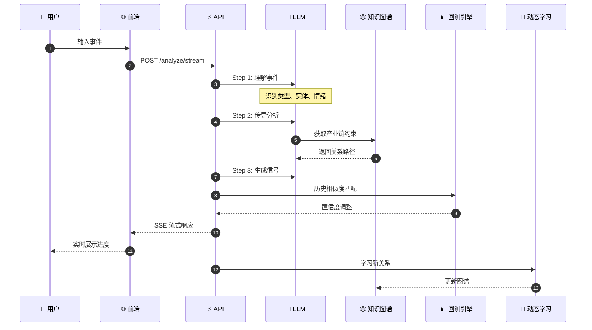
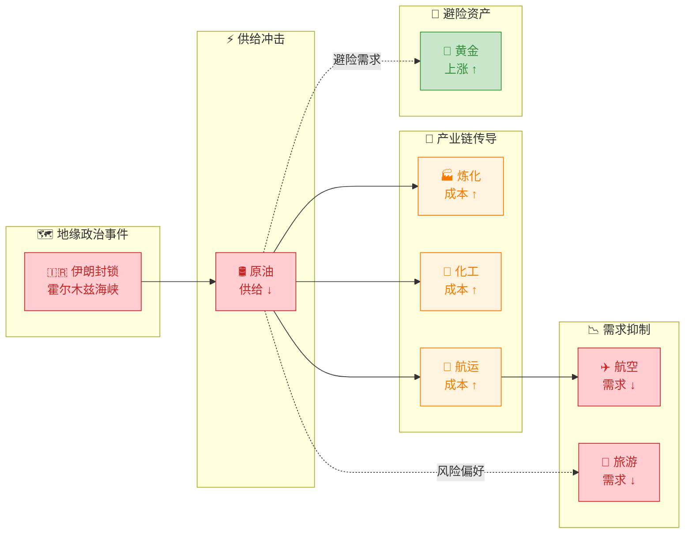
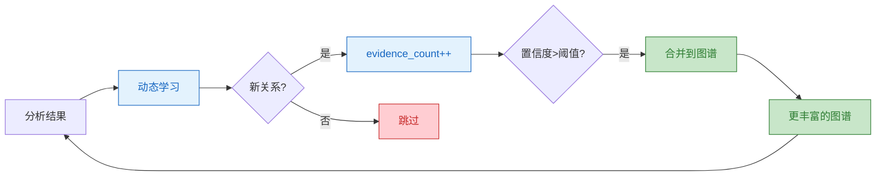

# 📊 Event Trading Analysis System

<div align="center">

*A Machine Learning powered event-driven trading analysis system*

[](https://www.python.org/)
[](https://fastapi.tiangolo.com/)
[](https://nextjs.org/)
[](https://www.typescriptlang.org/)
[]()
[](https://www.docker.com/)

</div>

> 🧠 基于大语言模型的事件驱动交易分析系统 | 自动推理产业链传导路径 | 生成可执行投资信号

---

## 🎯 系统架构

```
┌─────────────────────────────────────────────────────────────────────────────────────┐
│                                      用户输入                                        │
│                               "美国与伊朗爆发军事冲突"                                  │
└─────────────────────────────────────────────────────────────────────────────────────┘
                                          │
                                          ▼
┌─────────────────────────────────────────────────────────────────────────────────────┐
│  ┌─────────┐ ┌─────────┐ ┌─────────┐ ┌─────────┐ ┌─────────┐                        │
│  │ 事件摘要 │ │ 传导图谱 │ │ 传导明细 │ │ 历史回测 │ │ 交易建议 │     ◄── 前端界面   │
│  └────┬────┘ └────┬────┘ └────┬────┘ └────┬────┘ └────┬────┘                        │
└───────┼────────────┼────────────┼────────────┼────────────┼──────────────────────────┘
        │            │            │            │            │
        │ SSE 流式响应 ◄──────────┘            │            │
        │            │                       │            │
        ▼            ▼                       ▼            ▼
┌─────────────────────────────────────────────────────────────────────────────────────┐
│                            🚀 FastAPI 网关                                          │
│                   /api/v1/analyze    /api/v1/analyze/stream                         │
└─────────────────────────────────────────────────────────────────────────────────────┘
                                          │
          ┌───────────────────────────────┼───────────────────────────────┐
          │                               │                               │
          ▼                               ▼                               ▼
┌─────────────────┐             ┌─────────────────┐             ┌─────────────────┐
│   Step 1        │             │   Step 2        │             │   Step 3        │
│   事件理解       │────────────►│   传导分析       │────────────►│   信号生成       │
│   (LLM)         │             │   (LLM + 图谱)   │             │   (LLM)         │
└─────────────────┘             └────────┬────────┘             └─────────────────┘
                                        │
              ┌─────────────────────────┼─────────────────────────┐
              │                         │                         │
              ▼                         ▼                         ▼
     ┌────────────────┐      ┌────────────────┐         ┌────────────────┐
     │   知识图谱       │      │   动态学习      │         │   回测引擎      │
     │   产业链关系     │      │   反馈闭环      │         │   置信度校准    │
     │   (networkx)    │      │  (learner)     │         │  (backtest)    │
     └────────────────┘      └────────────────┘         └────────────────┘
              │                         │                         │
              └─────────────────────────┼─────────────────────────┘
                                        │
                                        ▼
                            ┌─────────────────────┐
                            │     RAG 服务         │
                            │  实时市场数据注入    │
                            └──────────┬──────────┘
                                       │
                                       ▼
                            ┌─────────────────────┐
                            │   AkShare / Tushare │
                            │     财经数据源       │
                            └─────────────────────┘
```

---

## 📈 分析流程



---

## 🔄 传导推理示例



---

## 项目理念

在全球化市场中，重大地缘政治事件、政策变化、突发灾难往往在数小时至数天内沿产业链快速传导，引发相关行业股价的连锁反应。传统量化模型依赖历史数据，难以捕捉这些「黑天鹅」事件的非典型影响。

本系统利用大语言模型的逻辑推理能力，从事件原文出发，**自动构建产业链传导路径**，并结合知识图谱约束、回测验证、实时市场数据，生成可执行的投信号。

---

## 核心能力

| 能力 | 说明 |
|------|------|
| **事件理解** | LLM 自动识别事件类型（地缘政治/政策/灾难/经济数据等）、核心实体、市场情绪 |
| **产业链传导** | 推理事件在产业链中的多级传导路径（成本传导 / 需求传导 / 替代效应） |
| **交易信号** | 生成做多/做空信号及置信度，支持 A 股、美股、ETF |
| **回测验证** | 基于历史相似事件动态调整信号置信度 |
| **动态学习** | 从每次分析中自动发现新产业链关系，构建反馈闭环 |
| **流式展示** | 实时展示 LLM 推理过程（SSE），用户可见分析步骤 |

---

## 核心技术亮点

### 1. 分层递进式 LLM Pipeline

```
Step 1 (事件理解) → Step 2 (传导分析) → Step 3 (信号生成)
```

每一步的输出作为下一步的输入，上下文逐步丰富。所有 LLM 调用要求结构化 JSON 输出，Pydantic 解析确保类型安全。

### 2. 知识图谱作为确定性骨架

```python
# 产业链知识图谱（networkx + JSON）
# 节点：原油、天然气、化工、航空...
# 边：原油→化工（成本传导，70%，7天）
# 边：原油→航运（成本传导，80%，1天）

# 传导分析时，注入格式化图谱约束
# "优先遵循图谱约束，补充跨行业联系（如风险偏好传导）"
```

知识图谱提供确定性产业链关系，LLM 在其基础上推理未覆盖的跨行业联系，平衡泛化能力与准确性。

### 3. 动态学习反馈闭环



从分析结果中自动学习新产业链关系（evidence_count 增量提升置信度），发现的事件模式用于类型匹配增强。

### 4. 回测驱动的置信度校准

```
当前事件 → 历史相似事件匹配 → 置信度调整
           (相似度加权：标题25%+类型20%+实体重叠30%+情绪25%)

高相似度(>0.8) → +10% 置信度
低相似度(<0.4) → -10% 置信度
```

不是执行回测交易，而是基于历史事件模式动态调整信号置信度，提升信号可靠性。

### 5. 事件类型驱动的 RAG 上下文

```python
EVENT_TYPE_CONTEXT_MAP = {
    "地缘政治": {
        "news_priority": ["地缘", "冲突", "制裁", "外交"],
        "market_data": ["能源", "军工", "黄金", "外汇"],
        "include_hot_sectors": True
    },
    "政策": {
        "news_priority": ["央行", "财政", "监管", "政策"],
        "market_data": ["银行", "证券", "房地产", "保险"],
        ...
    },
    ...
}
```

RAG 服务根据事件类型选择性注入相关上下文（新闻优先级 + 市场数据类型），而非检索全部数据，降低噪声。

### 6. 纯 SVG 手绘传导图谱

前端使用纯 SVG 手绘传导网络图（非第三方图库），实现了：
- 分层布局算法（按传导深度分层，同层垂直居中）
- 贝塞尔曲线边（三阶贝塞尔曲线连接节点）
- 边宽度编码（传导率越高边越粗）
- Hover 交互（高亮相关边，显示 Tooltip）

---

## 功能演示

**输入事件：**
```
美国与伊朗爆发军事冲突，伊朗封锁霍尔木兹海峡
```

**系统输出：**

### Step 1: 事件理解
- **事件类型**: 地缘政治
- **核心实体**: 美国、伊朗、霍尔木兹海峡
- **市场情绪**: -0.85（极度利空）
- **直接受影响**: 原油（供给减少，+8）、航运（成本上升，-5）

### Step 2: 传导分析
```
原油 → 石油加工（成本传导，70%，3天）
原油 → 化工（成本传导，60%，7天）
原油 → 航运（成本传导，80%，1天）
航运 → 航空（成本传导，70%，5天）
```

### Step 3: 交易信号
| 行业 | 信号 | 置信度 | 相关标的 |
|------|------|--------|----------|
| 石油开采 | 做多 | 85% | 中国石油、中海油、XOM |
| 航运 | 做空 | 75% | 中远海控、达飞海运 |
| 航空 | 做空 | 70% | 中国国航、美国航空 |

---

## 技术栈

| 层级 | 技术 |
|------|------|
| 后端 | FastAPI · Python 3.11+ · Pydantic · networkx · uvicorn |
| LLM | SiliconFlow（推荐）· OpenAI · Claude · Ollama |
| 前端 | Next.js 14 · React 18 · TypeScript · Tailwind CSS |
| 图谱 | networkx · pyvis（交互图）· 纯 SVG（手绘图）|
| 数据 | AkShare · Tushare（免费数据源）|
| 容器 | Docker · Docker Compose v2 · Nginx |

---

## 目录结构

```
event-trading-system/
├── deploy.sh              # VPS 一键部署脚本
├── docker-compose.yml     # 容器编排（含 Nginx 反向代理）
├── nginx.conf             # Nginx 配置（HTTP + HTTPS 模板）
├── .env.example           # 环境变量模板
│
├── backend/
│   ├── app/
│   │   ├── main.py           # FastAPI 入口
│   │   ├── config.py         # 配置管理
│   │   ├── schemas/
│   │   │   └── models.py     # Pydantic 数据模型
│   │   └── services/
│   │       ├── llm_client.py       # 多 LLM 封装 + 降级机制
│   │       ├── prompts.py          # Prompt 模板
│   │       ├── analysis.py         # 事件分析服务（核心编排）
│   │       ├── rag_service.py      # RAG 实时上下文
│   │       ├── network_graph.py    # 传导图谱生成
│   │       ├── semantic_matcher.py # 语义匹配器
│   │       ├── causal_reasoning/   # 因果推理模块
│   │       │   ├── industry_graph.py      # 产业链知识图谱
│   │       │   ├── dynamic_graph_learner.py # 动态学习
│   │       │   └── llm_reasoner.py         # LLM 增强评分
│   │       ├── signal_output/
│   │       │   └── llm_explainer.py        # 市场评论生成
│   │       ├── impact_quant/         # 回测系统
│   │       │   ├── event_backtest.py      # 事件回测引擎
│   │       │   └── historical_signals.py  # 历史信号库
│   │       ├── event_extraction/
│   │       │   └── llm_extractor.py        # LLM 事件提取
│   │       └── data_providers/       # 数据提供者
│   │           ├── base.py
│   │           ├── akshare_provider.py
│   │           └── tushare_provider.py
│   └── requirements.txt
│
└── frontend/
    ├── src/
    │   ├── app/page.tsx              # 主页面（5 Tab 架构）
    │   ├── components/
    │   │   ├─ TransmissionGraph.tsx  # SVG 传导图谱
    │   │   ├── TransmissionChain.tsx   # 传导链列表
    │   │   ├── SentimentMeter.tsx     # 情绪仪表盘
    │   │   ├── DegradationBanner.tsx # 降级提示
    │   │   └── Sidebar.tsx            # 输入面板
    │   ├── hooks/
    │   │   └── useAnalysis.ts         # SSE 流式分析 Hook
    │   └── types/
    │       └── index.ts
    └── Dockerfile
```

---

## API 接口

```bash
# 普通分析（非流式）
POST /api/v1/analyze
{
  "title": "美国与伊朗爆发军事冲突",
  "content": "伊朗宣布封锁霍尔木兹海峡..."
}

# 流式分析（SSE，逐步返回）
POST /api/v1/analyze/stream

# 知识图谱统计
GET /api/v1/knowledge-graph/stats

# 态学习关系
GET /api/v1/knowledge-graph/relationships?min_confidence=0.5

# 历史回测统计
GET /api/v1/history/events

# 健康检查
GET /health
```

---

## 部署说明

### Docker 部署（本地 / VPS 通用）

```bash
git clone https://github.com/mkih76/event-driven-trading-system.git
cd event-driven-trading-system

# 配置 API Key
cp .env.example .env
# 编辑 .env 填入 SILICONFLOW_API_KEY（推荐：https://cloud.siliconflow.cn）

# 启动
docker compose up -d

# 访问
open http://localhost
```

### 手动部署

**后端：**
```bash
cd backend
python -m venv venv && source venv/bin/activate  # Windows: venv\Scripts\activate
pip install -r requirements.txt
cp ../.env.example .env && vi .env  # 填入 API Key
uvicorn app.main:app --reload --port 8080
```

**前端：**
```bash
cd frontend
npm install
npm run dev
# 访问 http://localhost:3000
```

---

## VPS 部署后管理

> **注意**: 需要 VPS 有 2G+ 内存（向量模型加载需要 300-500MB）

```bash
# 进入目录
cd /opt/event-trading-system

# 查看日志
docker compose logs -f

# 重启服务
docker compose restart

# 更新代码
git pull && docker compose up -d --build

# 停止服务
docker compose down
```

---

## License

MIT