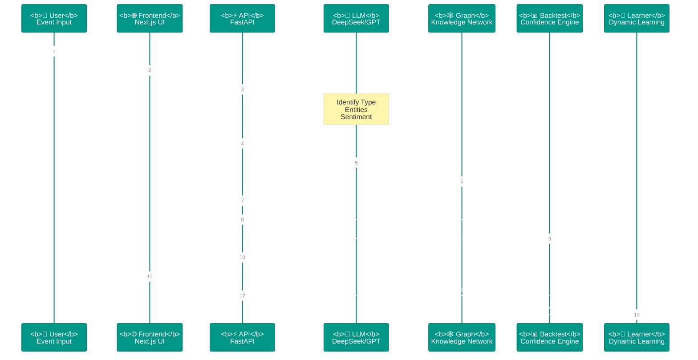

# 🧠 Event Trading Intelligence System

<div align="center">

### AI-Powered Event-Driven Trading Analysis Platform

[](https://www.python.org/)
[](https://fastapi.tiangolo.com/)
[](https://nextjs.org/)
[](https://www.typescriptlang.org/)
[](https://pytorch.org/)
[]()
[](https://www.docker.com/)

</div>

> 🧠 基于大语言模型的事件驱动交易分析系统 | 自动推理产业链传导路径 | 生成可执行投资信号

---

## 🎯 系统架构

```
┌─────────────────────────────────────────────────────────────────────────────────────────────┐
│                                    USER INPUT                                                │
│                                  "US-IRAN Military Conflict"                                  │
└─────────────────────────────────────────────────────────────────────────────────────────────┘
                                              │
                    ┌─────────────────────────┼─────────────────────────┐
                    │                         │                         │
                    ▼                         ▼                         ▼
┌───────────────────────────────────┐ ┌───────────────────────────────┐ ┌───────────────────┐
│  ┌─────────┐ ┌─────────┐         │ │ ┌─────────┐ ┌─────────┐       │ │ ┌─────────┐       │
│  │ Event   │ │ Trans.  │         │ │ │ Trans.  │ │ Back-   │       │ │ │ Signal  │       │
│  │ Summary │ │ Map     │         │ │ │ Details │ │ test    │       │ │ │ Report  │       │
│  └────┬────┘ └────┬────┘         │ │ └────┬────┘ └────┬────┘       │ │ └────┬────┘       │
└───────┼───────────┼───────────────┼─┼──────┼──────────┼────────────┼─┼──────┼─────────────┘
        │           │               │ │      │          │            │ │      │
        │    SSE Streaming ◄────────┘ │      │          │            │ │      │
        │           │                 │      │          │            │ │      │
        ▼           ▼                 ▼      ▼          ▼            ▼ ▼      ▼
┌─────────────────────────────────────────────────────────────────────────────────────────────┐
│                                        ⚡ FastAPI Gateway                                     │
│                                /api/v1/analyze  │  /api/v1/analyze/stream                   │
└─────────────────────────────────────────────────────────────────────────────────────────────┘
                                              │
                    ┌─────────────────────────┼─────────────────────────┐
                    │                         │                         │
                    ▼                         ▼                         ▼
        ┌───────────────────┐     ┌───────────────────────┐     ┌───────────────────┐
        │    STEP 1         │     │    STEP 2             │     │    STEP 3         │
        │  ┌─────────────┐  │     │  ┌─────────────────┐  │     │  ┌─────────────┐  │
        │  │ Event       │  │     │  │ Transmission    │  │     │  │ Signal      │  │
        │  │ Understanding│ │────►│  │ Analysis       │  │────►│  │ Generation  │  │
        │  │    (LLM)    │  │     │  │ (LLM + Graph)  │  │     │  │    (LLM)    │  │
        │  └─────────────┘  │     │  └────────┬────────┘  │     │  └─────────────┘  │
        └───────────────────┘     └───────────┼───────────┘     └───────────────────┘
                                              │
                    ┌─────────────────────────┼─────────────────────────┐
                    │                         │                         │
                    ▼                         ▼                         ▼
           ┌────────────────┐      ┌────────────────────┐       ┌────────────────┐
           │   Knowledge    │      │   Dynamic          │       │   Backtest    │
           │   Graph        │      │   Learning         │       │   Engine       │
           │   Industry     │      │   Feedback Loop    │       │   Confidence   │
           │   Relations    │      │   (learner)        │       │   Calibration   │
           └────────┬───────┘      └─────────┬──────────┘       └────────┬───────┘
                    │                         │                         │
                    └─────────────────────────┼─────────────────────────┘
                                              │
                                              ▼
                                 ┌────────────────────────┐
                                 │      RAG Service       │
                                 │   Real-time Market     │
                                 │   Data Injection       │
                                 └───────────┬────────────┘
                                             │
                                             ▼
                                 ┌────────────────────────┐
                                 │   AkShare / Tushare    │
                                 │   Financial Data API   │
                                 └────────────────────────┘
```

---

## 📈 Analysis Pipeline



---

## 🔄 Transmission Reasoning

```mermaid
%%{init: {'theme': 'base', 'themeVariables': { 'primaryColor': '#1a237e', 'primaryTextColor': '#fff', 'primaryBorderColor': '#0d47a1', 'lineColor': '#5c6bc0', 'secondaryColor': '#303f9f', 'tertiaryColor': '#1a237e'}}}%%
graph TB
    subgraph Event["🌍 GEO-POLITICAL EVENT"]
        IRAN["⚔️ IRAN blockades<br/>Strait of Hormuz"]
    end

    subgraph Supply["📦 SUPPLY SHOCK"]
        OIL["🛢️ CRUDE OIL<br/>Supply ↓ 15%"]
    end

    subgraph Transmission["⚡ INDUSTRY CHAIN"]
        REFIN["🏭 REFINING<br/>Cost ↑ 20%"]
        CHEM["🧪 PETROCHEM<br/>Cost ↑ 15%"]
        SHIP["🚢 MARINE<br/>Cost ↑ 25%"]
    end

    subgraph Demand["📉 DEMAND IMPACT"]
        AVIATION["✈️ AVIATION<br/>Demand ↓ 10%"]
        TOURISM["🏨 TOURISM<br/>Demand ↓ 8%"]
    end

    subgraph Safe["💎 SAFE HAVEN"]
        GOLD["🥇 GOLD<br/>↑ 5-8%"]
    end

    IRAN -->|{"duration": "1-3d"}| OIL
    OIL -->|{"rate": "70%", "delay": "3d"}| REFIN
    OIL -->|{"rate": "60%", "delay": "7d"}| CHEM
    OIL -->|{"rate": "80%", "delay": "1d"}| SHIP
    SHIP -->|{"rate": "70%", "delay": "5d"}| AVIATION
    OIL -.->|"Risk Aversion"| TOURISM
    OIL -.->|"Safe Haven"| GOLD

    classDef eventNode fill:#c62828,stroke:#b71c1c,color:#fff,stroke-width:2px
    classDef supplyNode fill:#e65100,stroke:#bf360c,color:#fff,stroke-width:2px
    classDef transNode fill:#1565c0,stroke:#0d47a1,color:#fff,stroke-width:2px
    classDef demandNode fill:#6a1b9a,stroke:#4a148c,color:#fff,stroke-width:2px
    classDef safeNode fill:#2e7d32,stroke:#1b5e20,color:#fff,stroke-width:2px

    class IRAN eventNode
    class OIL supplyNode
    class REFIN,CHEM,SHIP transNode
    class AVIATION,TOURISM demandNode
    class GOLD safeNode
```

---

## 🎯 Project Philosophy

> In the globalized market, major geo-political events, policy changes, and unexpected disasters often transmit rapidly through industry chains within hours to days, triggering chain reactions in related stock prices. Traditional quantitative models relying on historical data struggle to capture these "black swan" events' atypical impacts.

This system leverages LLM's logical reasoning capability to **automatically construct industry chain transmission paths** from raw events, combined with knowledge graph constraints, backtest verification, and real-time market data to generate actionable trading signals.

**Key Innovations:**
- 🎯 **LLM-Driven Reasoning** — Go beyond historical patterns to reason about novel events
- 🔗 **Graph-Constrained Transmission** — Deterministic relationships + flexible generalization
- 📊 **Confidence Calibration** — Backtest-driven signal reliability
- 🔄 **Self-Learning Loop** — Continuous knowledge graph enrichment

---

## ⚡ Core Capabilities

| Capability | Description |
|:------------|:------------|
| **🤖 Event Understanding** | LLM auto-identifies event type (geo-political/policy/disaster/economic), core entities, market sentiment |
| **🔗 Industry Chain Transmission** | Multi-level transmission reasoning (cost transmission / demand transmission / substitution effect) |
| **📊 Trading Signals** | Long/short signals with confidence levels, supporting A-shares, US stocks, ETFs |
| **⚙️ Backtest Verification** | Dynamic confidence adjustment based on historical similar events |
| **🔄 Dynamic Learning** | Auto-discover new industry chain relationships, build feedback loop |
| **⚡ Real-time Streaming** | SSE streaming display of LLM reasoning process |

---

## 🚀 Technical Highlights

### 1. Layered LLM Pipeline

```
STEP 1 (Event Understanding) ──► STEP 2 (Transmission Analysis) ──► STEP 3 (Signal Generation)
```

Each step's output feeds into the next, with context progressively enriching. All LLM calls require structured JSON output with Pydantic validation for type safety.

### 2. Knowledge Graph as Deterministic Skeleton

```python
# Industry Knowledge Graph (networkx + JSON)
# Nodes: Crude Oil, Natural Gas, Petrochem, Aviation...
# Edges: Crude Oil → Petrochem (cost transmission, 70%, 7 days)
# Edges: Crude Oil → Marine (cost transmission, 80%, 1 day)

# During transmission analysis, inject formatted graph constraints
# "Prioritize graph constraints, supplement cross-industry links (e.g., risk appetite transmission)"
```

Knowledge graph provides deterministic industry chain relationships; LLM reasons beyond coverage for cross-industry generalization while maintaining accuracy.

### 3. Dynamic Learning Feedback

```mermaid
%%{init: {'theme': 'base', 'themeVariables': { 'primaryColor': '#00695c', 'primaryTextColor': '#fff', 'primaryBorderColor': '#004d40', 'lineColor': '#26a69a'}}}%%
graph LR
    A[📊 Analysis Result] --> B[🔄 Dynamic Learning]
    B --> C{{"🤔 New Relationship?"}}
    C -->|YES| D[📈 evidence_count++]
    D --> E{({"📉 Confidence > Threshold?"})}
    E -->|YES| F[✅ Merge to Graph]
    F --> G[📊 Enriched Knowledge Graph]
    G --> A
    C -->|NO| H[⏭️ Skip]
    E -->|NO| H

    classDef processNode fill:#1565c0,stroke:#0d47a1,color:#fff,stroke-width:2px
    classDef decisionNode fill:#6a1b9a,stroke:#4a148c,color:#fff,stroke-width:2px
    classDef yesNode fill:#2e7d32,stroke:#1b5e20,color:#fff,stroke-width:2px
    classDef noNode fill:#62757f,stroke:#455a64,color:#fff,stroke-width:2px

    class B processNode
    class C,E decisionNode
    class F,G yesNode
    class A,H noNode
```

从分析结果中自动学习新产业链关系（evidence_count 增量提升置信度），发现的事件模式用于类型匹配增强。

### 4. Backtest-Driven Confidence Calibration

```
Current Event ──► Historical Similarity Match ──► Confidence Adjustment
                  (Similarity Weighted: Title 25% + Type 20% + Entity Overlap 30% + Sentiment 25%)

High Similarity (>0.8) ──► +10% Confidence
Low Similarity (<0.4)  ──► -10% Confidence
```

Not executing backtest trades, but dynamically adjusting signal confidence based on historical event patterns to improve signal reliability.

### 5. Event Type Driven RAG Context

```python
EVENT_TYPE_CONTEXT_MAP = {
    "geo-political": {
        "news_priority": ["geo", "conflict", "sanction", "diplomacy"],
        "market_data": ["energy", "military", "gold", "forex"],
        "include_hot_sectors": True
    },
    "policy": {
        "news_priority": ["central bank", "fiscal", "regulation", "policy"],
        "market_data": ["bank", "securities", "real estate", "insurance"],
        ...
    },
    ...
}
```

RAG service selectively injects relevant context (news priority + market data types) based on event type, not retrieving all data to reduce noise.

### 6. Pure SVG Hand-Drawn Transmission Graph

Frontend implements pure SVG hand-drawn transmission network (no third-party libraries), featuring:
- **Layered Layout Algorithm** (stratified by transmission depth, same layer vertically centered)
- **Bezier Curve Edges** (cubic Bezier curves connecting nodes)
- **Edge Width Encoding** (higher transmission rate = thicker edge)
- **Interactive Hover** (highlight related edges, display Tooltip)

---

## 💡 Demo: US-Iran Military Conflict Analysis

**Input:**
```
US-IRAN military conflict, Iran blockades Strait of Hormuz
```

**System Output:**

### STEP 1: Event Understanding
- **Event Type:** Geo-political
- **Core Entities:** USA, Iran, Strait of Hormuz
- **Market Sentiment:** -0.85 (extremely bearish)
- **Direct Impact:** Crude Oil (supply reduction, +8), Marine (cost increase, -5)

### STEP 2: Transmission Analysis
```
CRUDE OIL → REFINING (cost transmission, 70%, 3 days)
CRUDE OIL → PETROCHEM (cost transmission, 60%, 7 days)
CRUDE OIL → MARINE (cost transmission, 80%, 1 day)
MARINE → AVIATION (cost transmission, 70%, 5 days)
```

### STEP 3: Trading Signals
| Industry | Signal | Confidence | Related Assets |
|:---------|:-------|:-----------|:---------------|
| Oil Exploration | LONG | 85% | CNOOC, XOM, CVX |
| Marine Shipping | SHORT | 75% | Cosco, CMA CGM |
| Aviation | SHORT | 70% | Air China, American Airlines |

---

## 🛠️ Tech Stack

| Layer | Technology |
|:------|:-----------|
| **Backend** | FastAPI · Python 3.11+ · Pydantic · networkx · uvicorn |
| **LLM** | SiliconFlow (Recommended) · OpenAI · Claude · Ollama |
| **Frontend** | Next.js 14 · React 18 · TypeScript · Tailwind CSS |
| **Graph** | networkx · pyvis (Interactive) · Pure SVG (Hand-drawn) |
| **Data** | AkShare · Tushare (Free Data Sources) |
| **Infra** | Docker · Docker Compose v2 · Nginx |

---

## 📂 Project Structure

```
event-trading-system/
├── deploy.sh              # VPS one-click deployment
├── docker-compose.yml     # Container orchestration (with Nginx)
├── nginx.conf             # Nginx config (HTTP + HTTPS template)
├── .env.example           # Environment variables template
│
├── backend/
│   ├── app/
│   │   ├── main.py           # FastAPI entry point
│   │   ├── config.py         # Configuration management
│   │   ├── schemas/
│   │   │   └── models.py     # Pydantic data models
│   │   └── services/
│   │       ├── llm_client.py       # Multi-LLM wrapper + fallback
│   │       ├── prompts.py          # Prompt templates
│   │       ├── analysis.py         # Event analysis (core orchestration)
│   │       ├── rag_service.py      # RAG real-time context
│   │       ├── network_graph.py    # Transmission graph generation
│   │       ├── semantic_matcher.py # Semantic matcher
│   │       ├── causal_reasoning/   # Causal reasoning module
│   │       │   ├── industry_graph.py      # Industry knowledge graph
│   │       │   ├── dynamic_graph_learner.py # Dynamic learning
│   │       │   └── llm_reasoner.py         # LLM enhanced scoring
│   │       ├── signal_output/
│   │       │   └── llm_explainer.py        # Market commentary generation
│   │       ├── impact_quant/         # Backtest system
│   │       │   ├── event_backtest.py      # Event backtest engine
│   │       │   └── historical_signals.py  # Historical signal library
│   │       ├── event_extraction/
│   │       │   └── llm_extractor.py        # LLM event extraction
│   │       └── data_providers/       # Data providers
│   │           ├── base.py
│   │           ├── akshare_provider.py
│   │           └── tushare_provider.py
│   └── requirements.txt
│
└── frontend/
    ├── src/
    │   ├── app/page.tsx              # Main page (5-tab layout)
    │   ├── components/
    │   │   ├─ TransmissionGraph.tsx  # SVG transmission graph
    │   │   ├── TransmissionChain.tsx   # Transmission chain list
    │   │   ├── SentimentMeter.tsx     # Sentiment gauge
    │   │   ├── DegradationBanner.tsx # Fallback banner
    │   │   └── Sidebar.tsx            # Input panel
    │   ├── hooks/
    │   │   └── useAnalysis.ts         # SSE streaming analysis hook
    │   └── types/
    │       └── index.ts
    └── Dockerfile
```

---

## 🔌 API Endpoints

```bash
# Normal analysis (non-streaming)
POST /api/v1/analyze
{
  "title": "US-IRAN Military Conflict",
  "content": "Iran announces blockade of Strait of Hormuz..."
}

# Streaming analysis (SSE, step-by-step response)
POST /api/v1/analyze/stream

# Knowledge graph statistics
GET /api/v1/knowledge-graph/stats

# Dynamic learning relationships
GET /api/v1/knowledge-graph/relationships?min_confidence=0.5

# Historical backtest statistics
GET /api/v1/history/events

# Health check
GET /health
```

---

## 🚀 Deployment

### Docker Deployment (Local / VPS)

```bash
git clone https://github.com/mkih76/event-driven-trading-system.git
cd event-driven-trading-system

# Configure API Key
cp .env.example .env
# Edit .env to add SILICONFLOW_API_KEY (Recommended: https://cloud.siliconflow.cn)

# Start
docker compose up -d

# Access
open http://localhost
```

### Manual Deployment

**Backend:**
```bash
cd backend
python -m venv venv && source venv/bin/activate  # Windows: venv\Scripts\activate
pip install -r requirements.txt
cp ../.env.example .env && vi .env  # Add API Key
uvicorn app.main:app --reload --port 8080
```

**Frontend:**
```bash
cd frontend
npm install
npm run dev
# Access http://localhost:3000
```

---

## 🖥️ VPS Post-Deployment Management

> **Note:** VPS requires 2G+ RAM (vector model loading needs 300-500MB)

```bash
# Enter directory
cd /opt/event-trading-system

# View logs
docker compose logs -f

# Restart services
docker compose restart

# Update code
git pull && docker compose up -d --build

# Stop services
docker compose down
```

---

## 📜 License

MIT