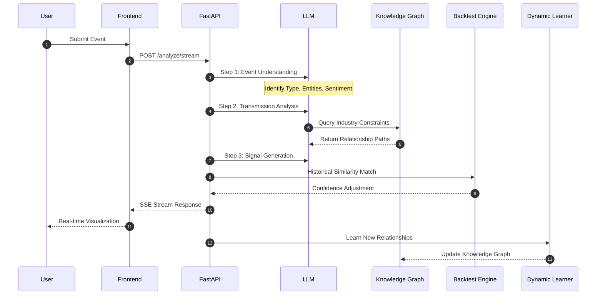
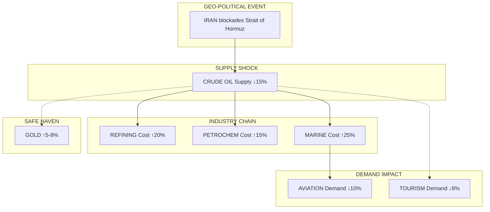
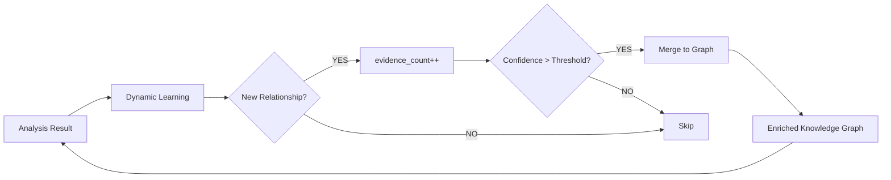

# Event Trading Intelligence System

<div align="center">

### AI-Powered Event-Driven Trading Analysis Platform

[](https://www.python.org/)
[](https://fastapi.tiangolo.com/)
[](https://nextjs.org/)
[](https://www.typescriptlang.org/)
[](https://pytorch.org/)
[]()
[](https://www.docker.com/)

</div>

> 基于大语言模型的事件驱动交易分析系统 | 自动推理产业链传导路径 | 生成可执行投资信号

---

## Table of Contents

1. [System Architecture](#1-system-architecture)
2. [Analysis Pipeline](#2-analysis-pipeline)
3. [Transmission Reasoning Example](#3-transmission-reasoning-example)
4. [Project Philosophy](#4-project-philosophy)
5. [Core Capabilities](#5-core-capabilities)
6. [Technical Highlights](#6-technical-highlights)
7. [System Demonstration](#7-system-demonstration)
8. [Tech Stack](#8-tech-stack)
9. [Project Structure](#9-project-structure)
10. [API Reference](#10-api-reference)
11. [Deployment Guide](#11-deployment-guide)
12. [License](#12-license)

---

## 1. System Architecture

```
┌─────────────────────────────────────────────────────────────────────────────────────────────┐
│                                        USER INPUT                                            │
│                              "US-IRAN Military Conflict"                                     │
└─────────────────────────────────────────────────────────────────────────────────────────────┘
                                              │
                    ┌─────────────────────────┼─────────────────────────┐
                    │                         │                         │
                    ▼                         ▼                         ▼
┌───────────────────────────────────┐ ┌───────────────────────────────┐ ┌───────────────────┐
│  ┌─────────┐ ┌─────────┐         │ │ ┌─────────┐ ┌─────────┐       │ │ ┌─────────┐       │
│  │ Event   │ │ Trans.  │         │ │ │ Trans.  │ │ Back-   │       │ │ │ Signal  │       │
│  │ Summary │ │ Map     │         │ │ │ Details │ │ test    │       │ │ │ Report  │       │
│  └────┬────┘ └────┬────┘         │ │ └────┬────┘ └────┬────┘       │ │ └────┬────┘       │
└───────┼───────────┼───────────────┼─┼──────┼──────────┼────────────┼─┼──────┼─────────────┘
        │           │               │ │      │          │            │ │      │
        │    SSE Streaming ◄────────┘ │      │          │            │ │      │
        │           │                 │      │          │            │ │      │
        ▼           ▼                 ▼      ▼          ▼            ▼ ▼      ▼
┌─────────────────────────────────────────────────────────────────────────────────────────────┐
│                                       FastAPI Gateway                                         │
│                           /api/v1/analyze  |  /api/v1/analyze/stream                         │
└─────────────────────────────────────────────────────────────────────────────────────────────┘
                                              │
                    ┌─────────────────────────┼─────────────────────────┐
                    │                         │                         │
                    ▼                         ▼                         ▼
        ┌───────────────────┐     ┌───────────────────────┐     ┌───────────────────┐
        │      STEP 1       │     │       STEP 2          │     │      STEP 3       │
        │  ┌─────────────┐  │     │  ┌─────────────────┐  │     │  ┌─────────────┐  │
        │  │ Event       │  │     │  │ Transmission    │  │     │  │ Signal      │  │
        │  │ Understanding│ │───► │  │ Analysis       │  │───► │  │ Generation  │  │
        │  │   (LLM)    │  │     │  │ (LLM + Graph)  │  │     │  │   (LLM)    │  │
        │  └─────────────┘  │     │  └────────┬────────┘  │     │  └─────────────┘  │
        └───────────────────┘     └───────────┼───────────┘     └───────────────────┘
                                              │
                    ┌─────────────────────────┼─────────────────────────┐
                    │                         │                         │
                    ▼                         ▼                         ▼
           ┌────────────────┐      ┌────────────────────┐       ┌────────────────┐
           │    Knowledge   │      │      Dynamic        │       │    Backtest   │
           │      Graph     │      │      Learning       │       │     Engine    │
           │  Industry Rel.  │      │    Feedback Loop   │       │  Confidence   │
           └────────┬───────┘      └─────────┬──────────┘       └────────┬───────┘
                    │                         │                         │
                    └─────────────────────────┼─────────────────────────┘
                                              │
                                              ▼
                                 ┌────────────────────────┐
                                 │      RAG Service       │
                                 │  Real-time Market Data  │
                                 └───────────┬────────────┘
                                             │
                                             ▼
                                 ┌────────────────────────┐
                                 │   AkShare / Tushare    │
                                 │   Financial Data API   │
                                 └────────────────────────┘
```

---

## 2. Analysis Pipeline



---

## 3. Transmission Reasoning Example

### 3.1 Flow Diagram



### 3.2 Transmission Chains

| Path | Type | Rate | Delay |
|:-----|:-----|:-----|:------|
| IRAN → CRUDE OIL | Supply Shock | 100% | 1-3d |
| CRUDE OIL → REFINING | Cost Transmission | 70% | 3d |
| CRUDE OIL → PETROCHEM | Cost Transmission | 60% | 7d |
| CRUDE OIL → MARINE | Cost Transmission | 80% | 1d |
| MARINE → AVIATION | Cost Transmission | 70% | 5d |
| CRUDE OIL → TOURISM | Risk Aversion | - | - |
| CRUDE OIL → GOLD | Safe Haven | - | - |

---

## 4. Project Philosophy

In the globalized market, major geo-political events, policy changes, and unexpected disasters often transmit rapidly through industry chains within hours to days, triggering chain reactions in related stock prices. Traditional quantitative models relying on historical data struggle to capture these "black swan" events' atypical impacts.

This system leverages LLM's logical reasoning capability to **automatically construct industry chain transmission paths** from raw events, combined with knowledge graph constraints, backtest verification, and real-time market data to generate actionable trading signals.

### Key Innovations

| Innovation | Description |
|:-----------|:------------|
| **LLM-Driven Reasoning** | Go beyond historical patterns to reason about novel events |
| **Graph-Constrained Transmission** | Deterministic relationships + flexible generalization |
| **Confidence Calibration** | Backtest-driven signal reliability |
| **Self-Learning Loop** | Continuous knowledge graph enrichment |

---

## 5. Core Capabilities

| Capability | Description |
|:-----------|:------------|
| **Event Understanding** | LLM auto-identifies event type (geo-political/policy/disaster/economic), core entities, market sentiment |
| **Industry Chain Transmission** | Multi-level transmission reasoning (cost transmission / demand transmission / substitution effect) |
| **Trading Signals** | Long/short signals with confidence levels, supporting A-shares, US stocks, ETFs |
| **Backtest Verification** | Dynamic confidence adjustment based on historical similar events |
| **Dynamic Learning** | Auto-discover new industry chain relationships, build feedback loop |
| **Real-time Streaming** | SSE streaming display of LLM reasoning process |

---

## 6. Technical Highlights

### 6.1 Layered LLM Pipeline

```
STEP 1 (Event Understanding) ──► STEP 2 (Transmission Analysis) ──► STEP 3 (Signal Generation)
```

Each step's output feeds into the next, with context progressively enriching. All LLM calls require structured JSON output with Pydantic validation for type safety.

### 6.2 Knowledge Graph as Deterministic Skeleton

```python
# Industry Knowledge Graph (networkx + JSON)
# Nodes: Crude Oil, Natural Gas, Petrochem, Aviation...
# Edges: Crude Oil → Petrochem (cost transmission, 70%, 7 days)
# Edges: Crude Oil → Marine (cost transmission, 80%, 1 day)

# During transmission analysis, inject formatted graph constraints
# "Prioritize graph constraints, supplement cross-industry links"
```

Knowledge graph provides deterministic industry chain relationships; LLM reasons beyond coverage for cross-industry generalization while maintaining accuracy.

### 6.3 Dynamic Learning Feedback



From analysis results, automatically learn new industry chain relationships (evidence_count increments to boost confidence), discovered event patterns are used for type matching enhancement.

### 6.4 Backtest-Driven Confidence Calibration

```
Current Event ──► Historical Similarity Match ──► Confidence Adjustment
                  (Weighted: Title 25%, Type 20%, Entity 30%, Sentiment 25%)

High Similarity (>0.8) ──► +10% Confidence
Low Similarity (<0.4)  ──► -10% Confidence
```

Not executing backtest trades, but dynamically adjusting signal confidence based on historical event patterns to improve signal reliability.

### 6.5 Event Type Driven RAG Context

```python
EVENT_TYPE_CONTEXT_MAP = {
    "geo-political": {
        "news_priority": ["geo", "conflict", "sanction", "diplomacy"],
        "market_data": ["energy", "military", "gold", "forex"],
        "include_hot_sectors": True
    },
    "policy": {
        "news_priority": ["central bank", "fiscal", "regulation"],
        "market_data": ["bank", "securities", "real estate", "insurance"],
        ...
    },
    ...
}
```

RAG service selectively injects relevant context (news priority + market data types) based on event type, not retrieving all data to reduce noise.

### 6.6 Pure SVG Hand-Drawn Transmission Graph

Frontend implements pure SVG hand-drawn transmission network (no third-party libraries), featuring:
- **Layered Layout Algorithm** (stratified by transmission depth, same layer vertically centered)
- **Bezier Curve Edges** (cubic Bezier curves connecting nodes)
- **Edge Width Encoding** (higher transmission rate = thicker edge)
- **Interactive Hover** (highlight related edges, display Tooltip)

---

## 7. System Demonstration

### 7.1 Input

```
US-IRAN military conflict, Iran blockades Strait of Hormuz
```

### 7.2 Output

#### Step 1: Event Understanding
- **Event Type:** Geo-political
- **Core Entities:** USA, Iran, Strait of Hormuz
- **Market Sentiment:** -0.85 (extremely bearish)
- **Direct Impact:** Crude Oil (supply reduction, +8), Marine (cost increase, -5)

#### Step 2: Transmission Analysis

| Source | Target | Type | Rate | Delay |
|:-------|:-------|:-----|:-----|:------|
| CRUDE OIL | REFINING | Cost Transmission | 70% | 3d |
| CRUDE OIL | PETROCHEM | Cost Transmission | 60% | 7d |
| CRUDE OIL | MARINE | Cost Transmission | 80% | 1d |
| MARINE | AVIATION | Cost Transmission | 70% | 5d |

#### Step 3: Trading Signals

| Industry | Signal | Confidence | Related Assets |
|:---------|:-------|:-----------|:---------------|
| Oil Exploration | LONG | 85% | CNOOC, XOM, CVX |
| Marine Shipping | SHORT | 75% | Cosco, CMA CGM |
| Aviation | SHORT | 70% | Air China, American Airlines |

---

## 8. Tech Stack

| Layer | Technology |
|:------|:-----------|
| **Backend** | FastAPI, Python 3.11+, Pydantic, networkx, uvicorn |
| **LLM** | SiliconFlow (Recommended), OpenAI, Claude, Ollama |
| **Frontend** | Next.js 14, React 18, TypeScript, Tailwind CSS |
| **Graph** | networkx, pyvis (Interactive), Pure SVG (Hand-drawn) |
| **Data** | AkShare, Tushare (Free Data Sources) |
| **Infra** | Docker, Docker Compose v2, Nginx |

---

## 9. Project Structure

```
event-trading-system/
├── deploy.sh              # VPS one-click deployment script
├── docker-compose.yml     # Container orchestration (with Nginx)
├── nginx.conf             # Nginx configuration (HTTP + HTTPS template)
├── .env.example           # Environment variables template
│
├── backend/
│   ├── app/
│   │   ├── main.py           # FastAPI entry point
│   │   ├── config.py         # Configuration management
│   │   ├── schemas/
│   │   │   └── models.py     # Pydantic data models
│   │   └── services/
│   │       ├── llm_client.py       # Multi-LLM wrapper + fallback
│   │       ├── prompts.py          # Prompt templates
│   │       ├── analysis.py         # Event analysis (core orchestration)
│   │       ├── rag_service.py      # RAG real-time context
│   │       ├── network_graph.py    # Transmission graph generation
│   │       ├── semantic_matcher.py # Semantic matcher
│   │       ├── causal_reasoning/   # Causal reasoning module
│   │       │   ├── industry_graph.py
│   │       │   ├── dynamic_graph_learner.py
│   │       │   └── llm_reasoner.py
│   │       ├── signal_output/
│   │       │   └── llm_explainer.py
│   │       ├── impact_quant/       # Backtest system
│   │       │   ├── event_backtest.py
│   │       │   └── historical_signals.py
│   │       ├── event_extraction/
│   │       │   └── llm_extractor.py
│   │       └── data_providers/      # Data providers
│   │           ├── base.py
│   │           ├── akshare_provider.py
│   │           └── tushare_provider.py
│   └── requirements.txt
│
└── frontend/
    ├── src/
    │   ├── app/page.tsx
    │   ├── components/
    │   │   ├── TransmissionGraph.tsx
    │   │   ├── TransmissionChain.tsx
    │   │   ├── SentimentMeter.tsx
    │   │   ├── DegradationBanner.tsx
    │   │   └── Sidebar.tsx
    │   ├── hooks/
    │   │   └── useAnalysis.ts
    │   └── types/
    │       └── index.ts
    └── Dockerfile
```

---

## 10. API Reference

### 10.1 Analyze Event (Non-Streaming)

```http
POST /api/v1/analyze
Content-Type: application/json

{
  "title": "US-IRAN Military Conflict",
  "content": "Iran announces blockade of Strait of Hormuz..."
}
```

### 10.2 Analyze Event (Streaming)

```http
POST /api/v1/analyze/stream
```

Response: Server-Sent Events (SSE) stream

### 10.3 Knowledge Graph

```http
# Statistics
GET /api/v1/knowledge-graph/stats

# Relationships
GET /api/v1/knowledge-graph/relationships?min_confidence=0.5
```

### 10.4 Historical Events

```http
GET /api/v1/history/events
```

### 10.5 Health Check

```http
GET /health
```

---

## 11. Deployment Guide

### 11.1 Local Deployment

#### Prerequisites
- Docker Desktop 20.10+
- Git

#### Steps

```bash
# 1. Clone repository
git clone https://github.com/mkih76/event-driven-trading-system.git
cd event-driven-trading-system

# 2. Configure environment
cp .env.example .env
# Edit .env to add SILICONFLOW_API_KEY

# 3. Start services
docker compose up -d

# 4. Access
# Frontend: http://localhost
# API: http://localhost:8080
# Health: http://localhost:8080/health
```

#### Manual Setup (Alternative)

**Backend:**
```bash
cd backend
python -m venv venv
source venv/bin/activate  # Windows: venv\Scripts\activate
pip install -r requirements.txt
cp ../.env.example .env
# Edit .env to add API Key
uvicorn app.main:app --reload --port 8080
```

**Frontend:**
```bash
cd frontend
npm install
npm run dev
# Access http://localhost:3000
```

---

### 11.2 Cloud Deployment (VPS)

#### Prerequisites
- Ubuntu 20.04+ / Debian 11+
- 2G+ RAM (vector model loading needs 300-500MB)
- Domain name (optional, for HTTPS)

#### One-Click Deployment

```bash
# Login to VPS as root
bash <(curl -sL https://raw.githubusercontent.com/mkih76/event-driven-trading-system/master/deploy.sh)
```

The script will:
1. Install Docker and Docker Compose
2. Clone/pull the repository
3. Configure environment variables (interactive)
4. Set up firewall (ports 22, 80, 443)
5. Build and start containers
6. Perform health checks

#### Manual VPS Setup

```bash
# 1. Install Docker
curl -fsSL https://get.docker.com | sh
systemctl enable docker

# 2. Install Docker Compose
curl -L "https://github.com/docker/compose/releases/latest/download/docker-compose-$(uname -s)-$(uname -m)" -o /usr/local/bin/docker-compose
chmod +x /usr/local/bin/docker-compose

# 3. Create directory
mkdir -p /opt/event-trading-system
cd /opt/event-trading-system

# 4. Clone repository
git clone https://github.com/mkih76/event-driven-trading-system.git .
git clone https://github.com/mkih76/event-driven-trading-system.git /opt/event-trading-system

# 5. Configure environment
cp .env.example .env
# Edit .env with your API keys

# 6. Start services
docker compose up -d --build

# 7. Configure firewall
ufw allow 22/tcp
ufw allow 80/tcp
ufw allow 443/tcp
ufw --force enable
```

#### Optional: HTTPS Configuration

```bash
# Install certbot
apt-get update && apt-get install -y certbot python3-certbot-nginx

# Obtain SSL certificate
certbot --nginx -d your-domain.com --noninteractive --agree-tos -m admin@your-domain.com

# Auto-renewal (optional)
certbot renew --dry-run
```

#### Post-Deployment Management

| Command | Description |
|:--------|:------------|
| `docker compose logs -f` | View real-time logs |
| `docker compose restart` | Restart all services |
| `docker compose restart backend` | Restart backend only |
| `git pull && docker compose up -d --build` | Update and rebuild |
| `docker compose down` | Stop all services |
| `docker compose exec backend python -m pytest` | Run tests |

#### Troubleshooting

```bash
# Check container status
docker compose ps

# Check logs
docker compose logs backend
docker compose logs frontend
docker compose logs nginx

# Rebuild specific service
docker compose up -d --build backend

# Reset database (if needed)
docker compose exec backend rm -f /app/data/events.db
docker compose restart backend
```

---

## 12. License

MIT License

Copyright (c) 2024 Event Trading Intelligence System

Permission is hereby granted, free of charge, to any person obtaining a copy
of this software and associated documentation files (the "Software"), to deal
in the Software without restriction, including without limitation the rights
to use, copy, modify, merge, publish, distribute, sublicense, and/or sell
copies of the Software, and to permit persons to whom the Software is
furnished to do so, subject to the following conditions:

The above copyright notice and this permission notice shall be included in all
copies or substantial portions of the Software.

THE SOFTWARE IS PROVIDED "AS IS", WITHOUT WARRANTY OF ANY KIND, EXPRESS OR
IMPLIED, INCLUDING BUT NOT LIMITED TO THE WARRANTIES OF MERCHANTABILITY,
FITNESS FOR A PARTICULAR PURPOSE AND NONINFRINGEMENT. IN NO EVENT SHALL THE
AUTHORS OR COPYRIGHT HOLDERS BE LIABLE FOR ANY CLAIM, DAMAGES OR OTHER
LIABILITY, WHETHER IN AN ACTION OF CONTRACT, TORT OR OTHERWISE, ARISING FROM,
OUT OF OR IN CONNECTION WITH THE SOFTWARE OR THE USE OR OTHER DEALINGS IN THE
SOFTWARE.